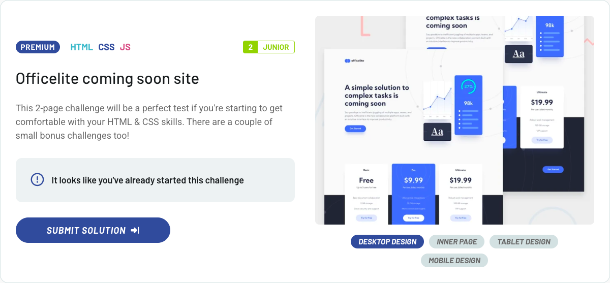

# Frontend Mentor – [Officelite Comming Soon Site]

  
Other status options

  
- 
- 
- 
- 
- 
- 

 

This is my solution for the [Officelite Comming Soon Site](https://www.frontendmentor.io/challenges/officelite-coming-soon-site-M4DIPNz8g) challenge from Frontend Mentor.

---

## 🔗 Live demo

👉 [View deployed version](https://pj-fm-ocs.netlify.app)

---

## 🛠 Technologies used

- HTML5 + BEM naming convention
- SCSS with `@use` and modular structure
- Flexbox + aspect-ratio for layout and scaling
- Decorative elements with `::before` / `::after`
- Manual SCSS build (no framework)

---

## 📁 Project structure

- **`assets/`** - static files, e.g. images or favicons
- **`assets/images/`** - images used in the component (QR code)
- **`scss/`** - modules with global styles, variables, mixins
- **`index.html`** - HTML structure of the component with BEM classes
- **`main.js`** - entry point for loading styles (via SCSS)
- **`dist/`** - folder for built output (ignored in Git)

---

## ✨ What I focused on

- A deliberately minimalist project where I focused on a consistent HTML and SCSS structure
- Using a modern SCSS approach with `@use`, variables and component modularity
- Maintaining visual fidelity of the design in Figma, including subtle shadows and backgrounds with decorative circles
- Working with `aspect-ratio` to maintain proper QR box ratio across devices
- Consistent use of BEM naming and clean layout without relying on JS or CSS frameworks

---

## 🧠 Key implementation notes

- The design for desktop and mobile used an identical component - I decided not to use media queries because they were not needed
- Box-shadow and spacings were exactly replicated according to Figma specifications, including opacity conversion (e.g. `4.77%` to `rgba`)
- Decorative circles in the background were implemented via pseudo-elements with absolute positioning
- The font "Outfit" was loaded via Google Fonts and plugged in as a SCSS variable for possible scalability in other components
- Paying attention to accessibility through semantic HTML (e.g., `h1`, `p`, `img` with `alt`) and proper document language declaration

---

## ✍️ Author

- GitHub – [pavel-jiranek-tech](https://github.com/pavel-jiranek-tech)
- Frontend Mentor – [@pavel-jiranek-tech](https://www.frontendmentor.io/profile/pavel-jiranek-tech)

---

## 📝 License

This project is part of a challenge on Frontend Mentor and is intended for educational and portfolio purposes only.
